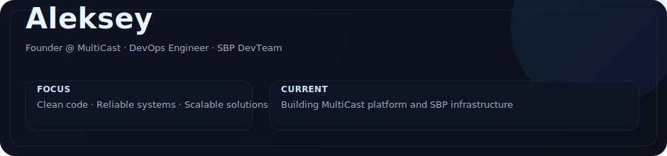
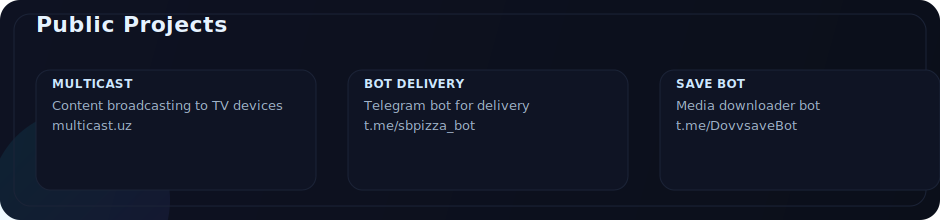
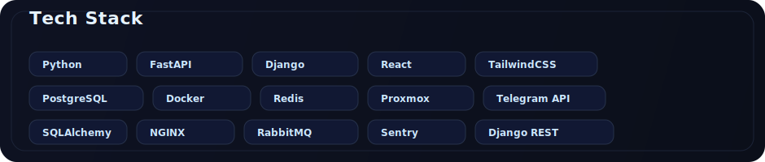
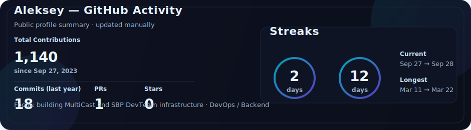
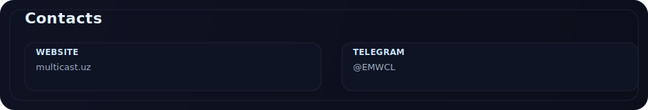

<h1 align="center">Aleksey</h1>

<b>⚡ Founder @ MultiCast | DevOps Engineer | SBP DevTeam ⚡</b>

<!-- Header -->

  

<!-- Projects -->

  

<!-- Tech Stack -->

  

<!-- Stats (из прошлого шага) -->

  

<!-- Contacts -->

  

  
  
  
  
  
  
  
  

