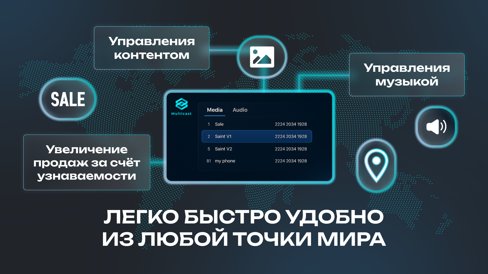

<h1 align="center">Aleksey</h1>

  
  

  <b>⚡ Founder @ MultiCast | DevOps Engineer | SBP DevTeam ⚡</b>

---

## 🚀 Обо мне
- 🧑‍💻 Основатель проекта **[MultiCast](https://multicast.uz/)**  
- 🔧 Ведущий разработчик и DevOps инженер в **SBP DevTeam**  
- ⚡ Строю системы, которые работают стабильно, масштабируются и реально приносят пользу  

---

## 🌍 Публичные проекты
- 🎥 **[MultiCast](https://multicast.uz/)** — система вещания контента на TV  
- 📦 **[Bot Delivery](https://t.me/sbpizza_bot)** — Telegram-бот для доставки  
- 💾 **[Save Bot](https://t.me/DovvsaveBot)** — медиа-загрузчик  

---

## 🛠 Стек технологий

  
  
  
  
  
  
  
  

---

## 📊 GitHub статистика

  
  

---

## 🎬 Атмосфера Dev

  
  

---

## 📬 Контакты
- 🌐 [multicast.uz](https://multicast.uz/)  
- 💬 Telegram: [@Aleksey](https://t.me/EMWCL)  

---

✨ *Clean code. Reliable systems. Scalable solutions.*

