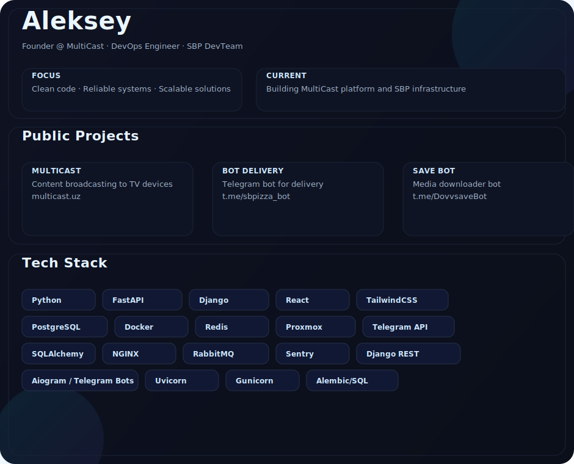

<h1 align="center">Aleksey</h1>

<b>⚡ Founder @ MultiCast | DevOps Engineer | SBP DevTeam ⚡</b>

---

<!-- Единый SVG (о себе, проекты, стек) -->

  

  
  
  

---

## 🌍 Публичные проекты

  
  
  
  
  

---

## 🛠 Технологии и стек

  
  
  
  
  
  
  
  

---

## 📌 Now
- 🚀 Работаю над **MultiCast 2.0** (Django + React + Tailwind)  
- 🤖 Разрабатываю **Telegram MiniApps** и экосистему ботов  
- ⚡ Строю **DevOps инфраструктуру (Proxmox, Redis, Docker, CI/CD)**  

---

## 🌟 Highlights
- 🚀 Создал **MultiCast** — систему вещания контента  
- 🧑‍💻 Более **1,100+ коммитов** в проектах за последний год  
- 🔧 Эксперт в **Backend & DevOps** интеграциях   
- 🎯 Создатель продуктов (**MultiCast**, боты доставки/медиа)  

---

## 📊 Активность

  
<b>📊 Показать активность</b>

  

    
  

  

    
  

---

## 📬 Контакты

  
  
 

---

> *“Code. Build. Scale. Inspire.”*
> 

  

